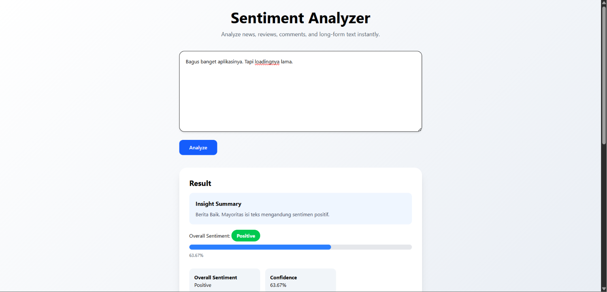
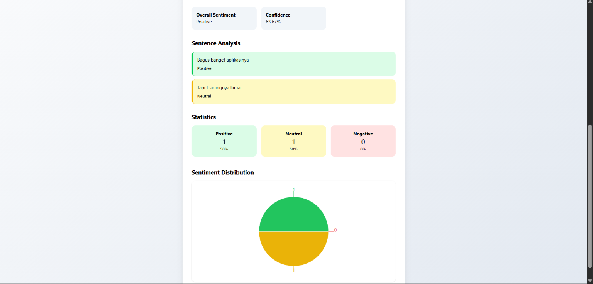

# 🚀 Sentiment Analysis Platform


---

## 📸 Tampilan Aplikasi

### Halaman Utama



---

### Hasil Analisis



---

Sebuah web aplikasi berbasis AI yang dapat menganalisis sentimen dari input pengguna, mulai dari satu kalimat sederhana hingga beberapa paragraf panjang.

Aplikasi ini akan mengklasifikasikan teks ke dalam tiga kategori:

* 🟢 Positif
* 🟡 Netral
* 🔴 Negatif

Selain memberikan hasil analisis secara keseluruhan, aplikasi ini juga melakukan analisis per kalimat sehingga pengguna bisa melihat bagian mana yang dianggap positif, negatif, atau netral.

Project ini saya bangun sebagai bagian dari portfolio Machine Learning dan Fullstack Development, mulai dari proses training model hingga deployment aplikasi.

---

## ✨ Fitur

* Analisis sentimen 3 kelas (Positive, Neutral, Negative)
* Analisis per kalimat
* Prediksi sentimen keseluruhan
* Confidence Score
* Statistik jumlah kalimat positif, netral, dan negatif
* Pipeline preprocessing teks Bahasa Indonesia
* REST API menggunakan FastAPI
* Tampilan web interaktif menggunakan React + TypeScript

---

## 🌐 Live Demo

### Frontend

**Vercel**

```
https://sentiment-analysis-platform.vercel.app
```

### Backend API

**Hugging Face Spaces**

```
https://erlandwt-sentiment-analysis-api.hf.space
```

### Dokumentasi API

```
https://erlandwt-sentiment-analysis-api.hf.space/docs
```

---

## 🛠️ Teknologi yang Digunakan

### Machine Learning

* Python
* Scikit-Learn
* TF-IDF Vectorizer
* Logistic Regression
* NLTK
* Sastrawi

### Backend

* FastAPI
* Uvicorn
* Joblib

### Frontend

* React
* TypeScript
* Vite
* Tailwind CSS
* Axios

### Deployment

* Vercel
* Hugging Face Spaces

---

## 🤖 Alur Machine Learning

```text
Dataset
   │
   ▼
Text Cleaning
   │
   ▼
Case Folding
   │
   ▼
Emoji Removal
   │
   ▼
Punctuation Removal
   │
   ▼
Normalisasi Slang Word
   │
   ▼
Stopword Removal
(Custom Important Words)
   │
   ▼
TF-IDF Vectorization
   │
   ▼
Logistic Regression
   │
   ▼
Prediction API
```

---

## 📊 Pemilihan Model

Pada tahap eksperimen, saya mencoba beberapa algoritma Machine Learning klasik:

| Model               | Accuracy |
| ------------------- | -------- |
| Logistic Regression | 0.7390   |
| Naive Bayes         | 0.8100   |
| Linear SVM          | 0.8200   |

Walaupun Naive Bayes dan Linear SVM memiliki accuracy yang lebih tinggi, Logistic Regression memberikan keseimbangan yang lebih baik pada Precision, Recall, dan F1-Score, terutama untuk kelas **Neutral** yang jumlah datanya relatif lebih sedikit.

Karena itu, Logistic Regression dipilih sebagai model utama untuk production.

---

## 📈 Cross Validation

### Hasil 5-Fold Cross Validation

```text
[0.7605, 0.7669, 0.7628, 0.7600, 0.7621]
```

### Rata-rata Score

```text
0.7625
```

Hasil tersebut menunjukkan bahwa model memiliki performa yang cukup konsisten pada beberapa pembagian data yang berbeda.

---

## 📁 Struktur Project

```text
sentiment-analysis-platform/

├── backend/
│   ├── app/
│   ├── models/
│   └── requirements.txt
│
├── frontend/
│   ├── src/
│   └── package.json
│
├── ml/
│   ├── datasets/
│   ├── notebooks/
│   └── src/
│   └── requirements.txt
│
└── README.md
```

---

## ⚙️ Menjalankan Project Secara Lokal

### Clone Repository

```bash
git clone https://github.com/your-username/sentiment-analysis-platform.git

cd sentiment-analysis-platform
```

### Menjalankan Backend

```bash
cd backend

pip install -r requirements.txt

uvicorn app.main:app --reload
```

Backend akan berjalan di:

```
http://127.0.0.1:8000
```

Dokumentasi API:

```
http://127.0.0.1:8000/docs
```

### Menjalankan Frontend

```bash
cd frontend

npm install

npm run dev
```

Frontend akan berjalan di:

```
http://localhost:5173
```

---

## 🔌 Contoh Penggunaan API

### Endpoint

```http
POST /predict
```

### Request

```json
{
  "text": "Bagus banget aplikasinya. Tapi loadingnya lama."
}
```

### Response

```json
{
  "overall_sentiment": "positive",
  "confidence": 0.78
}
```

---

## 🎯 Pengembangan Selanjutnya

Beberapa peningkatan yang ingin saya tambahkan pada versi berikutnya:

* Highlight sentimen langsung pada paragraf.
* Pemisahan kalimat yang lebih baik (termasuk tanda koma).
* Penambahan dataset untuk kelas Neutral.
* Improvement hasil Error Analysis.
* Retraining model dengan dataset yang lebih besar.
* Eksperimen menggunakan model Transformer seperti IndoBERT.

---

## 👨‍💻 Tentang Project Ini

Project ini dibuat sebagai sarana untuk memperdalam pemahaman mengenai:

* Text Preprocessing
* Feature Extraction (TF-IDF)
* Machine Learning Classification
* Model Evaluation
* FastAPI
* React + TypeScript
* Deployment aplikasi AI ke cloud

Seluruh proses, mulai dari eksplorasi data, training model, pembuatan API, frontend, hingga deployment dilakukan secara mandiri.

---

## 👤 Author

**Erland Widyatamaka**

Machine Learning & Backend Development Portfolio Project

**2026**
